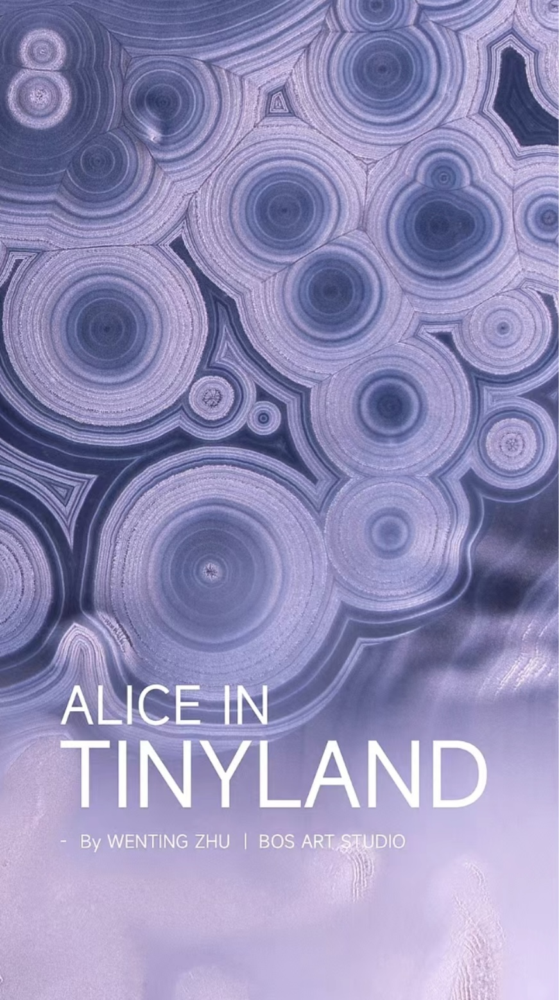
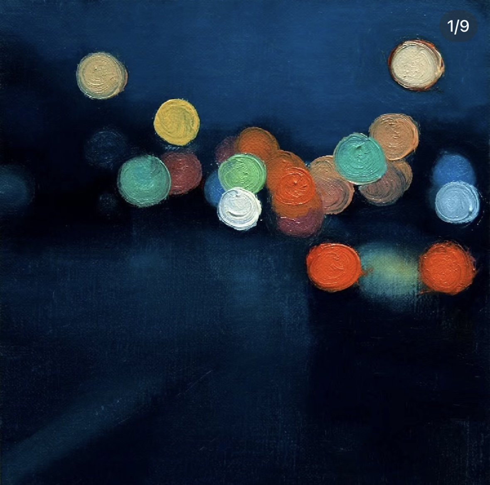
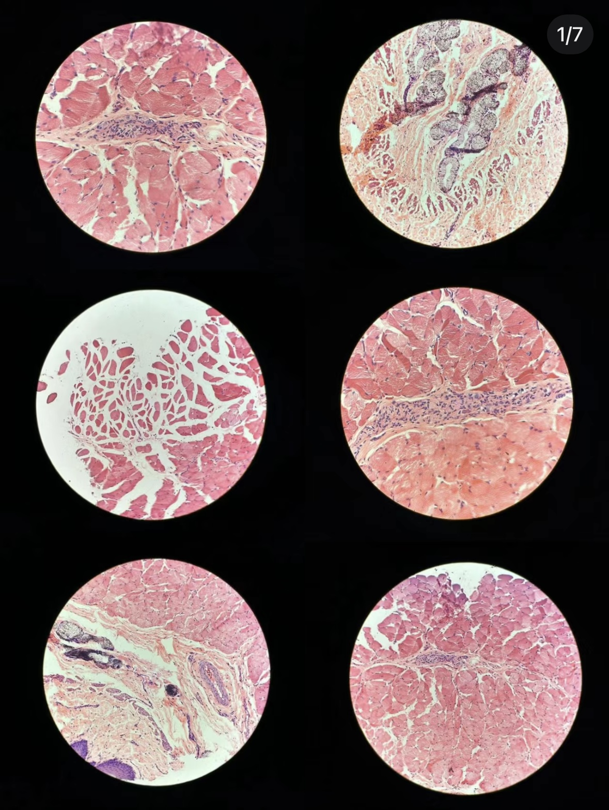

# xiwu0654_9103_tut5
My first repository for IDEA9103

This is my first local change to the repo

# Quiz 8 - Design Research for Major Assignment

## Part 1: Imaging Technique Inspiration

### Inspiration
For our group assignment, I found inspiration in three distinct images:

1. **Microscopic View of Cells**  
   The first image, showing cells under a microscope, inspired me to give an oval shape in our group’s image a "breathing" effect. This effect mirrors the microscopic world, setting the theme for my animation and giving a subtle sense of organic life to the visuals.

   

2. **Neon Light Artwork**  
   The second image is an artwork of neon lights, whose colors resemble our assignment’s palette. I aim to use Perlin noise and brightness modulation to create a flickering effect, mimicking the subtle shifts in neon light intensity, which aligns with our color scheme.

   

3. **Microscopic Texture**  
   The third image captures the textured quality of microscopic views, which I plan to recreate as an animated background. Using 2D Perlin noise, I’ll aim to simulate this fine-grain texture, adding depth and a tactile quality to the background of our project.

   

---

## Part 2: Coding Technique Exploration

### Techniques
To achieve these effects, I’ll employ the following coding techniques:

1. **Breathing Effect with Sinusoidal Animation**  
   By applying Perlin noise and scaling it to shapes, I’ll create a subtle "breathing" animation. This technique allows the shapes to rhythmically expand and contract, simulating an organic movement that mirrors the textures and dynamics of the microscopic world.

2. **Flickering Neon Effect with Perlin Noise**  
   For the flickering neon effect, I plan to use Perlin noise combined with brightness modulation, creating a natural, randomized flicker that enhances the color palette of our project.

3. **Textured Background with 2D Perlin Noise**  
   Finally, I’ll implement 2D Perlin noise to generate a texture reminiscent of microscopic detail, using it as an animated background to add depth to the composition.

Each technique will contribute to a cohesive visual theme inspired by microscopic imagery and organic textures.

**Code link/Tutorial**
- [Perlin Noise in two dimensions](https://www.youtube.com/watch?v=ikwNrFvnL3g&list=PLRqwX-V7Uu6bgPNQAdxQZpJuJCjeOr7VD&index=4)
- [Perlin Noise](https://p5js.org/examples/repetition-noise/)

---